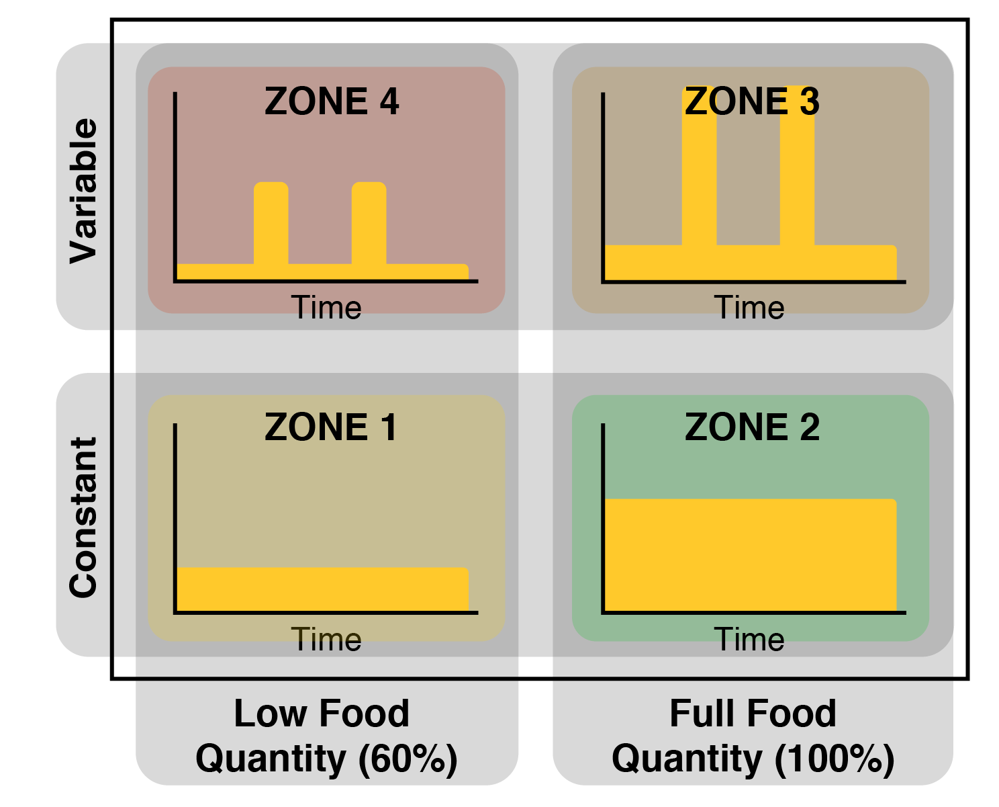

---
  output:
    pdf_document:
      keep_tex: true
      fig_caption: true
      latex_engine: pdflatex
  title: "Saved by the pulse?  Separating the effects of total and temporal food abundance on the performance of bumble bee microcolonies"
  author:
    - Jeremy Hemberger
    - Claudio Gratton
    - Agathe Frappa
    - Grant Witynski
  abstract: "The loss of flower-rich habitat to agriculture is a key factor contributing to bumble bee declines across Europe and North America.  Yet, agricultural intensification has not only altered flower abundance in the landscape, but also affected when flowers are available during the season (e.g., mass-flowering crops).  While we know that both total pollen and nectar and as well as temporal availability can impact bumble bee colony success (growth and reproductive output), we have yet to understand how these two factors combined might manifest.  We designed an experiment to decouple the effects of total food abundance and its temporal availability on bumble bee microcolony development, by exposing them to either constant or pulsed food availability at two ration levels, 100% and 60% ad-libitum food abundance.  Microcolonies provided constant, full-rations of food grew the most, while those fed variable, full-rations struggled to gain mass.  Regardless of temporal presentation, microcolonies fed 60% ad-libitum rations gained little mass over the experiment.  Reproductive output was greatest in microcolonies fed full-rations, regardless of the temporal availability of food, while those given 60% rations struggled to produce numerous drones.  This study highlights the importance of flower abundance in agricultural landscapes for both colony growth and reproduction, and suggests that increasing flower abundance could lead to improved colony fitness."
  keywords: "_Bombus impatiens_, colony growth, floral resources, temporal variability, agroecosystems"
  date: "`r format(Sys.time(), '%B %d, %Y')`"
  geometry: margin = 1in
  fontfamily: mathpazo
  fontsize: 11pt
  spacing: double
  header-includes:
    - \usepackage{setspace}\doublespacing
    - \usepackage[left]{lineno}
    - \linenumbers
  bibliography: ../library.bib
---

## Introduction
Bumble bee declines across Europe and North America are driven by a number of interacting anthropogenic factors (e.g., pesticides [@McArt2017], novel diseases from managed bees [@Brown2016a; @Furst2014] and climate change [@Kerr2015]). There is a growing consensus that habitat loss is the most important driver of decline [@Goulson2016].  In the US Midwest, two centuries of agricultural intensification (defined here as the spatially extensive increase of agrichemical use and proliferation of monocultures (e.g.[@Benton2003]) has removed bumble bee habitat - supplanting once continuous landscapes of prairie, savanna, and wetlands with highly productive agricultural crops [@Rhemtulla2007; @Smith1998].  Coincident with the transition to primarily agricultural land use in the US, several species of bumble bee have declined precipitously [@Grixti2009; @Cameron2011, @Jacobson2018a].  Indeed, threats posed to bumble bee populations have arisen from both direct and indirect effects of agricultural intensification. [@Roulston2011].

Most importantly, agricultural intensification has led to wholesale change in the abundance and temporal availability of floral resources in the landscape [@Goulson2008; @Schellhorn2015c; @Goulson2015c; @Vaudo2018].  Historically, landscapes containing a continuous supply of diverse floral resources (e.g., tall-grass prairies [@Hines2005]) were prolific, however many of these landscapes have been lost to commodity agriculture [@Smith1998].  Contemporary commodity crop landscapes in the Midwest, featuring decreased crop diversity in combination with an increased use of herbicides, have significantly reduced flowering plant availability [@Carvell2006b; @Goulson2015c], creating proverbial food deserts for bumble bees aside from small patches of remnant natural habitat.  In contrast, some agricultural landscapes contain mass-flowering crops (e.g., fruit crops, canola) that provide large pulses of floral resources, albeit over a short time period [@Westphal2009a; @Holzschuh2013; @Rundlof2014].  With respect to floral resource abundance, a range of possible landscapes exist in agriculturally dominated regions.  However, the trend has moved toward highly simplified landscapes, with floral resources available only during crop bloom.

The interaction between total floral resource abundance and temporal availability in the landscape can be visualized conceptually, as two potentially independent factors (Fig.1).  In this abstraction, 'Zone 1' landscapes contain few flowers that are constantly available over the course of the growing season.  This can be contrasted with 'Zone 3' landscapes that contain an abundance of flowers, but primarily only during two pulses (e.g., a mass-flowering crop).  This framework allows is to make simple predictions of how bumble bees are likely to respond to changes in floral resource abundance in the landscape.  We might expect, given that bumble bees are obligate flower visitors existing in long-lived colonies, that access do an abundance of flowers that are consistently available over time (e.g., 'Zone 2' landscapes) would be critical for successful colony development.

Total floral resource abundance is an important factor that contributes to the growth and reproductive success of bumble bee colonies.  For example, worker production is dependent on pollen and nectar influx to the colony; shortfalls can be detrimental to worker output [@Williams2012b], Carter and Dill, Sutcliffe and Plowright), and reproductive (drone and gyne) output can be enhanced with increased food availability [@Pelletier2003].  Despite variable effect sizes and experimental methodologies, most studies tend to agree that increased flower abundance leads to increased bumble bee abundance [e.g., @Carvell2007; @Blaauw2014] or colony performance [e.g., @Spiesman2017].

While total food availability is key for developing bumble bee colonies, when food is available can be equally important [@Schellhorn2015c].  Because bumble bee colonies have three distinct bottlenecks wherein food availability is crucial to colony success (queen colony establishment, colony worker buildup, and reproductive production), food shortages during any period of the colony life cycle can impair colony function.  As such, continuous availability of flowers in the landscape is believed to be paramount for bumble bees (e.g., Fig1, Zone 2)[@Martins2018].  Past work has examined the effect of total food abundance [@Rotheray2017] and temporal availability [@Schmid-Hempel1998a] on colony development independently, however we have yet to test the interactive effect of the two.  Is a lack of food, the temporal availability of food, or both limiting bumble bee colony success?  Parsing these two interacting factors apart could help explain specific mechanisms underlying bumble bee declines in agricultural landscapes, as well as provide conservation interventions.

To decouple the effects of total food abundance and temporal availability on bumble bee colony development, we designed a 2x2 factorial experiment that varied total food amount and its temporal availability.  Treatment designs were meant to simulate hypothetical scenarios that provide bumble bees either constantly available, or variable food resources at two ration levels: 100% and 60% ad-libitum (ad-lib) (Fig.1).  These may represent different modalities of food intake corresponding to different types of agricultural landscapes.  For example, bumble bees might experience landscapes containing few floral resources and only during one short period of time (e.g., Fig1, Zone 4) or a landscape containing many floral resources that are consistently available (e.g., Fig1, Zone 2).

Using microcolonies of the Common Eastern bumble bee (_Bombus impatiens_ Cresson), we tested the following hypotheses: (1) microcolonies provided 100% ad-lib food (pollen and nectar) in equally sized rations would gain the most mass and have the greatest reproductive output (e.g., zone 2); (2) microcolonies provided 100% ad-lib in pulses separated by periods of relative starvation would perform slightly worse compared to those provided 100% ad-lib in equal rations, as _B impatiens'_ population stability in agricultural landscapes suggests resilience to land-use change and variability in food quantity [@Cameron2011; @Grab2019]; (3) microcolonies provided 60% ad-lib would perform worst (zones 1 and 4), regardless of temporal treatment (equal, "zone 1" vs. pulse, "zone 4" rations), as colonies would be too nutritionally stressed, regardless of relatively large, episodic influxes of food in the pulsed colonies.

## Materials and methods
#### Experimental design and procedure
To assess the impact of varying total, and temporal food abundance on bumble bee colony production, we designed a 2x2 factorial experiment utilizing microcolonies of _B. impatiens_.  Microcolonies were used as proxies to full colonies given their ease of establishment and clear parallels to full colony development [@Dance2017; @Moerman2017].

In three experimental rounds, we established microcolonies from: (Round 1) 10 queen-right colonies sourced from Koppert Biological Systems (Howell, MI) in February of 2018; (Round 2) 10 queen-right colonies from Koppert Biological Systems in May of 2018; (Round 3) 10 queen-right colonies sourced from BioBest Biological (Romulus, MI) in October of 2018.  In each round, microcolony initiation was identical. We removed sets of 5 workers from a random colony and placed sets into 28 microcolony rearing boxes (10 x 15 x 10 cm - Sup Fig1), provisioning each with 2 grams of honey bee collected pollen homogenized with nectar and sealed in honey bee wax, as well as ad-libitum nectar through a sub-floor cotton wick and reservoir (ProSweet: MannLake LTD, Minnesota).  To allow microcolony initiation, we left colonies undisturbed for approximately 1 week.  Once we observed evidence of microcolony establishment (egg and larval brood cells) in each replicate box, we removed any remaining pollen and nectar, and initiated treatment regimes.  In order to ensure microcolonies had equal capacity to respond to food availability (i.e., 5 workers per box), we replaced any workers throughout the experiment that died with randomly selected workers from queen-right feeder colonies.

Over 8 weeks, we simulated landscape-scale food availability (both pollen and nectar) in four treatments - each representing a hypothetical landscape whereby total food abundance, and temporal availability were independently altered according to the factorial design (Fig1).  Treatment conditions (hereafter, "zones") were as follows: "Zone 1" microcolonies were fed equal rations at 60% ad-lib levels; "Zone 2" microcolonies were fed equal rations at 100% ad lib levels; "Zone 3" microcolonies were fed in total the same amount of food as Zone 2 microcolonies, but food resources were provided as two large pulses with periods of relative starvation (~60% ad-lib) encompassing the pulses;  "Zone 4" microcolonies temporal availability was the same as Zone 3, but with total food over the experiment equal to Zone 1, and periods of relative starvation between pulses at ~38% ad-lib. Seven microcolonies were randomly assigned to each treatment.  To determine total food rations supplied in each treatment over the course of the experiment, we used measurements reported in [@Rotheray2017] (which reported on ad-lib consumption rates of the ecological analog of _B. impatiens_, _B. terrestris_), scaling total experiment food abundance at 100% ad-lib to 5 workers (approximately 33 grams of pollen and 300 grams of nectar) over 17 feeding intervals (~ 8 weeks).  Reduced-ration treatments were scaled to 60% of that value.

Every 3 days (hereafter interval feeding days: IFD), we massed whole microcolonies by placing them on a scale and recording mass to the nearest 0.01 grams.  After massing, we fed microcolonies by providing an appropriately massed pollen ball and nectar cup (see Supplemental Material for feeding schedule and layout of microcolony box) depending on the food treatment.  After every 3 IFDs (every 9 Julian days), we removed and massed the pollen that was not consumed in the microcolony to calculate consumption. Nectar rations were replaced at every IFD - each massed before addition and after removal to determine nectar consumption (similar to [@Rotheray2017]).  We massed the microcolony before the removal or addition of food to ensure that measurements were comparable between IFDs.

To determine if treatments affected the relative fitness of each microcolony, we censused colonies at each IFD.  Censusing included tallying worker mortality, drone (male) emergence, and presence of different brood stages within the microcolony.  After tallying drones that had emerged, we removed and froze them for subsequent analysis. We determined average drone wet mass per IFD for each microcolony, individual drone intertegular distance (to nearest 0.01mm using ProgRes CapturePro v2.0), and average drone fat content per IFD (% fat in dry mass) using ether extraction method described by [@Samuelson2018]).

#### Data analysis
We performed all data management and statistical analyses in R, version 3.5.1 [@Rcite]. For each colony, we calculated the estimated "actual" microcolony mass relative to IFD 1.  The goal of this calculation was to best determine how much biomass was being added to the actual brood mass within the microcolony between IFDs while factoring out added, but not consumed, food:

$$
\begin{aligned}
Estimated Brood Mass_{IFD = n} = Microcolony Mass_{IFD = n} - Microcolony Mass_{IFD = 1} + \\
Pollen Consumed_{IFD = n} - Pollen Added_{IFD = n}
\end{aligned}
$$

where Microcolony Mass~IFD is the mass of the entire microcolony (including box) at `IFD = n`;  $Microcolony Mass_{IFD = 1}$ is the mass of the entire microcolony on the first IFD: we calculated mass gains relative the mass at IFD = 1; $Pollen Consumed_{IFD = n}$ is the average pollen consumed at `IFD = n`, determined by taking the pollen consumed over the course of 3 IFDs (determined after removing unconsumed pollen every 3 IFDs) and dividing by 3; and $Pollen Added_{IFD = n}$ is the mass of pollen added at at `IFD = n` (see example calculation in Supplemental Material).  In the event that missing data prevented $Estimated Brood Mass_{IFD = n}$ from being determined (< 1% of data), we interpolated the missing values using the `na.approx` function from the `zoo` R package.  Nectar storage/consumption within the microcolony was not considered for the $Microcolony Mass_{IFD = n}$ calculation, as we were not able to parse out nectar consumed by workers from nectar moved by workers to honey pots in the brood mass.  At the end of the experiment, we also measured the mass of the brood cluster (including all wax, remaining pupae, larvae, eggs, and nectar) alone after removing them from the microcolony boxes.

To evaluate whether treatments affected end of experiment brood mass, drone production, drone fitness parameters (wet mass and IT distance), or worker mortality, we constructed linear mixed-effects models (LMMs) on the combined data set from all three experimental rounds.  Each model took the general form of a given response variable as a function of treatment (full-factorial between total food abundance and temporal variability) and experimental round, with random intercept and slope estimates for each microcolony.  We estimated treatment means from LMMs (package: `lsmeans`) and used Tukey corrected pair-wise comparisons (package: `multcomp`) to determine significance between treatments.  All end-of-experiment total LMMs were built using the `nlme` package.

We also constructed repeated measures ANOVAs using the `nlme` package to model colony mass, IFD average and cumulative drone production, IFD average and cumulative worker mortality, as well as IFD average and cumulative nectar and pollen consumption throughout the course of the 8-week experiments.  These models took the general form of a given response as a function of treatment, date, and round, with a random effect of colony identity.  To account for temporal autocorrelation, each analysis included a first order autocorrelation structure (function: `corAR1`) with a time covariate of measurement date and a grouping factor of colony identity.  We specified the autocorrelation correction using the lag = 1 value from an identical model fitted with no autocorrelation structure.

Lastly, we calculated the growth rate of each microcolony for time periods relative food pulses (Before pulse 1, during pulse 1, after pulse 1 and before pulse 2, during pulse 2, and after pulse2).  This was accomplished by fitting a linear model of microcolony mass as a function of IFD (time).  We then extracted each slope coefficient (i.e., the growth rate for a given microcolony during an aforementioned time period) and constructed an ANOVA for each time period to determine differences in growth rates among treatments, within time periods.  The _P_-values associated with our initial slope estimates (mass as a function of IFD) were used to test whether growth was different than zero for a given time period.  We also constructed a repeated measures ANOVA for all slope estimates across all time periods to determine if there were statistical differences in temporal microcolony growth rates.

## Results
#### Microcolony establishment
Overall, microcolony establishment success was high across experimental rounds, with only 3 of 84  failing to initiate (96% success).  Two additional microcolonies contained a hyper-aggressive worker that killed all original and replacement nest-mates when establishing dominance.  Despite increased aggression, these single-worker colonies still produced males.  However, we removed them from analyses as the response of a single-worker microcolony to treatments was not comparable to standard, five-worker microcolonies.

#### Microcolony growth (mass and food consumption)
The magnitude, and pattern of microcolony growth depended strongly on treatment throughout the course fo the experiment (Fig 2A,C: F~3,73~ = 33.36, _P_ < 0.001).  End of experiment microcolony mass was driven by an interaction of both total food abundance, as well as temporal availability (Fig 2B,D: interaction effect, F~1,24~ = 6.72, _P_ = 0.016).  In the constant ration treatments (zones 1 and 2), end of experiment mass for zone 2 microcolonies was, on average, 92% greater than zone 1 microcolonies (Fig 2B, t~24~ = 4.35, _P_ = 0.001).  In the pulsed ration treatments (zones 3 and 4), end of experiment mass for zone 3 microcolonies was, on average, 27% more than zone 4 microcolonies, however the difference was not statistically clear (Fig 2D, t~24~ = 1.53 , _P_ = 0 .437).  Average mass at the end of the experiment for the two 100% ad-lib treatments (zones 2 and 3) was 56% greater for zone 2 relative to zone 3 (t = 3.523, _P_ = 0.008).  There was a statistically clear effect of experimental round on end of experiment mass, with rounds 2 and 3 overall weighing less at the end of the experiment relative to round 1 (F~2,50~ = 27.37, _P_ < 0.001).  However, the pattern of end of experiment mass across treatments was consistent between rounds (F~6,43~ = 0.685, _P_ = 0.663).

Microcolony growth rates over the course of the experiment varied by treatment (Fig 3: F~3,24~ = 5.60, _P_ = 0.004).  Overall, zone 2 average growth rate was the highest (t~24~ = 3.79, _P_ = 0.004), while zone 1 growth rates were only statistically above 0 during one time period (before pulse 1).  Growth rates were similar among pulsed-ration treatments.  Both pulsed-ration treatments experienced negative growth during periods following food pulses (after pulse 1/before pulse2, after pulse 2).  While mass gain was negligible during the first pulse, it was greatest during the second food pulse.  Surprisingly, there was no clear difference in growth rates between zones 2 (0.702 +/- 0.111 grams per period) and 4 (0.353 +/- 0.111 grams per period), despite having different end of experiment brood and average estimated masses.

Pollen consumption was impacted by both total food abundance and temporal availability (F~1,24~ = 6.07, _P_ = 0.021), with constant 100% ration microcolonies consuming the most (Pollen: 14.80 +/- 0.813 grams).  Zone 3 microcolony pollen consumption was not significantly different than zones 1 and 4, despite a 40% difference in pollen availability over the course of the experiment.  Nectar consumption followed a similar pattern, however consumption was driven by total abundance, and not temporal availability (F~1,24~ = 44.24, _P_ < 0.001), with zones 2 and 3 consuming a similar amount of nectar (119.10 +/- 3.60 grams and 112.26 +/- 3.53 grams, respectively: Supplemental Fig2).

#### Microcolony demography (drone production and worker mortality)
We found that total drone production varied as a function of total food abundance (Fig 4: F~1,24~ = 15.34, _P_ < 0.001).  Zone 2 microcolonies produced numerically the most males, but there was not a statistically clear difference between zones 2 and 3 (t~24~ = 1.538, _P_ = 0.431).  Both 60% ad-lib treatments produced on average 27% fewer drones, regardless of the pulse treatment.  There was an effect of experimental round on drone production, with rounds 2 and 3 overall producing fewer drones than in round 1.  However, like with end of experiment mass, the pattern of drone production relative to treatments was similar across experimental rounds (F~6,43~ = 0.685, _P_ = 0.663).  Worker mortality was identical regardless of treatment, with on average 9 worker deaths per microcolony throughout the course of the 8 week experiment (average of 1.1 per week).

The efficiency of conversion from food to drone was roughly similar across treatments: to produce 1 drone required on average 0.70 +/- 0.08 grams of pollen and 10 +/- 2.54 grams of nectar.  While there were no clear statistical differences (treatment ration size effect: F~1,24~ = 0.189, _P_ = 0.667; treatment pulse effect: F~1,24~ = 0.018, _P_ = 0.893), zones 2 and 4 microcolonies were numerically more efficient in producing drones, requiring on average 18% less pollen to produce a single drone.  Zones 1 and 3 were the least efficient, especially with nectar, 56% more to produce a single male relative to zones 2 and 4, however the differences were not statistically clear.

## Discussion
By manipulating the amount and temporal availability of pollen and nectar, we show that both temporal availability and total food amount affect microcolony growth and reproduction, respectively.  End of experiment microcolony mass was greatest when microcolonies were provided constant, full-rations.  This pattern matched our prediction that bumble bee microcolonies would grow the most when provided resources that mimic landscapes containing a high abundance of temporally consistent resources.  Indeed, microcolonies provided reduced, or temporally variable rations struggled to gain mass, with several exhibiting a net loss over the experiment.  However, drone production, arguably the most important metric of microcolony success, was only impacted by total food amount: colonies fed full rations produced more drones, regardless of temporal availability (i.e., Zone 2 vs. Zone 3).  The contrasting effects of total [e.g., @Rotheray2017] and temporal [e.g., @Schmid-Hempel1998a] food availability demonstrated in this study suggest that both factors are important to the overall success of _B. impatiens_ microcolonies.

#### Microcolony mass gain
Microcolonies provided constant, full-rations of food consistently gained mass over the course of the experiment. Regardless of their magnitude, food pulses were unable to rescue microcolony mass from dearth periods. In fact, microcolonies experiencing pulsed food availability exhibited dramatic swings in mass gain and loss coincident with pulse and dearth periods, respectively. In contrast, microcolonies experiencing constant rations were more consistent in their mass gain, with full-ration treatments on average gaining mass across all experimental periods, and reduced-ration treatments functionally remaining at zero.

Many studies examining bumble bee colony responses to environmental variables use mass as a proxy for reproductive output [@Goulson2002c; @Elliott2009; @Westphal2009a; @Williams2012b]. Indeed, mass in our experiments did tend to correlate with increased reproductive output (especially in the case of zone 2). In the absence of demographic data, the average lower final mass of zone 3 microcolonies might have suggested lower colony reproductive output. However, drone production was equivalent in pulsed, full-ration colonies - a signal that colony mass alone may not tell the complete story of bumble bee colony success. This finding corroborates other studies examining bumble bee reproductive success [@Williams2012b], and highlights the importance of additional supporting evidence to accompany trends in colony mass gain.

For our experiment, microcolony mass was our best estimate of the total biomass of workers, brood, and nesting materials at any given timepoint. Because bumble bees store nectar within their brood cluster, our estimate of microcolony mass may more accurately capture nectar acquisition and depletion. If so, this metric is still important as stored nectar is critical for brood incubation and worker caloric intake [@Heinrich2004; @Goulson2008, @Rotheray2017]. Additionally, estimated average microcolony mass at the last experimental time point corresponds well to the average final brood mass measured after microcolony termination (R^2^ = 0.59), suggesting our calculation of microcolony mass is accurate. Regardless of its true constituents, colony mass is best used in tandem with demographic or additional physical characteristics of the colony (e.g. estimated colony volume) in inferring colony “success”. Patterns of mass gain/loss are likely more appropriate to describe relative food intake and consumption, rather than reproductive output.  Despite this, colony mass is still an important metric given that size is an important precursor to the reproductive switch point of the colony [@Goulson2008].

#### Drone production
A lack of an interaction between total food and temporal availability revealed a statistically clear, positive effect of increased food abundance on drone production independent of temporal availability.  This result supports our hypothesis regarding _B. impatiens_ suspected tolerance of highly variable food environments.  That is, over time for _B.impatiens_, when food is presented is less important to drone productivity than how much food is available.  In fact, populations of _B. impatiens_, among several other species, remain stable in agriculturally dominated landscapes despite dearth periods of food, while other species (namely _B. affinis_ and _B. terricola_) have declined [@Cameron2011]. Worker polymorphism within _B. impatiens_ could explain this tolerance, as smaller workers are more robust to periods of nectar starvation [@Couvillon2010]. In our study, however, worker body size was not controlled for, as workers selected for a given microcolony were selected at random from natal colonies. Worker mortality was consistent across microcolonies and treatments, suggesting we did not unintentionally select smaller, more tolerant workers for any given treatment.

Drone size was greatest under full-ration conditions.  This is an important difference, as drones are crucial for gene flow via dispersal.  Therefore, colonies producing relatively large-bodied drones (which correlates with flight range [@Greenleaf2007b]) may be more successful in contributing genetic information to subsequent generations.  We might also expect that the total food-driven difference in drone size that we observed in this study would translate to full-colonies producing workers rather than drones.  Larger workers are known to have colony-level benefits thanks to increased foraging range and efficiency [@Peat2005; @Rotheray2017].  Interestingly, the treatment that produced the largest drones, Zone 3, was one of the least efficient at converting pollen into drones (though the difference in pollen consumption efficiency was not statistically clear).  This suggests that, while _B. impatiens_ seems robust to temporal fluctuations in food abundance, it comes at a cost of efficiency of food use.

Environmental stressors like food abundance and temporal availability are likely to impact species differently [@Roulston2011; @Woodard2017].  While studies examining _B. impatiens_ reproductive response to variable food abundance are lacking, experiments have documented enhanced reproductive success in variable resource environments for the European ecological analog, _B. terrestris_ [@Schmid-Hempel1998a].  For example, [@Schmid-Hempel1998a] found that variable access to food led to an increased rate of food collection (mass gain) and increased production of workers.  We found similar patterns of increased food collection rate among _B. impatiens_ microcolonies fed variable rations, especially during the second pulse of our experiment. However, we did not find variable food abundance elevated drone production, suggesting that bumble bee responses to total food abundance and temporal availability are likely to be species-specific.  Given this, it is important for future studies to consider comparative, interspecies studies which could identify species most sensitive to temporal bottlenecks in food availability [@Schellhorn2015c].  Such work would build on findings highlighting the importance of resource continuity for wild bee communities [@Martins2018], and could aid in the design of more friendly agricultural landscapes [@Landis2017].

#### Conclusions
Disentangling the contribution of environmental stressors to bumble bee decline is imperative if we are to be successful in stemming further declines.  In this study, we showed that temporal and total pollen and nectar availability interact to impact bumble bee microcolony growth, with microcolonies provided more, temporally consistent food growing the most.  We also showed that reproductive output was driven by total, and not temporal pollen and nectar availability: microcolonies provided full rations of pollen and nectar produced the most drones.  While we examined laboratory microcolonies, the responses observed should be indicative of a standard, queen-right colony [@Tasei2008; @Dance2017].  If anything, free-foraging, queen-right colonies are likely to see exacerbated responses to similar treatments, given that foraging is the most energetically expensive and risky activity for bumble bees.  Even though temporal availability did not impact the reproductive output of _B. impatiens_ in this study, other species of bumble bee need to be examined for their ability to cope with boom-bust cycles of food availability.  The implications of this work to managing landscapes is clear: at the least, an increase in total floral abundance (i.e., pollen and nectar) would likely have benefits to bumble bee colony reproduction.  However, increasing both total floral abundance as well as temporal continuity would benefit species tolerant of dearth periods, as well as those sensitive to nutritional stress.  Such efforts are essential to limit further loss of essential ecosystem service providers like bumble bees.

# References