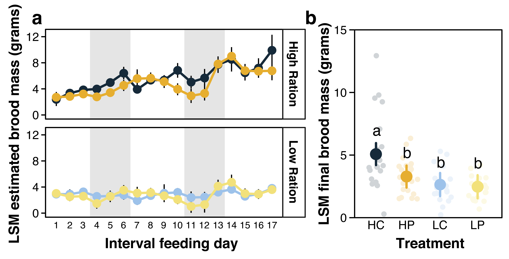
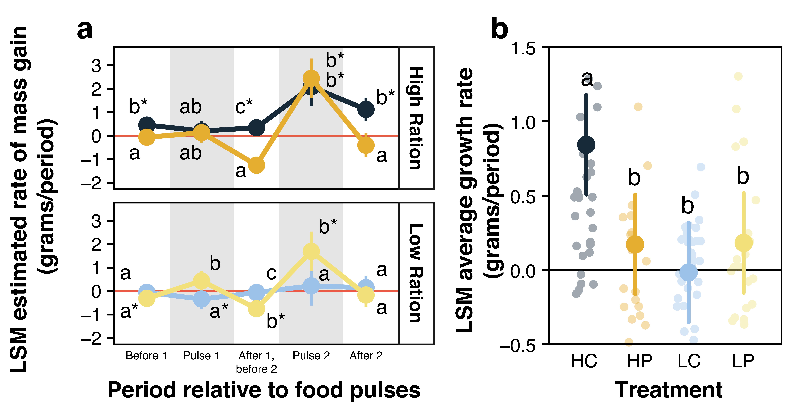
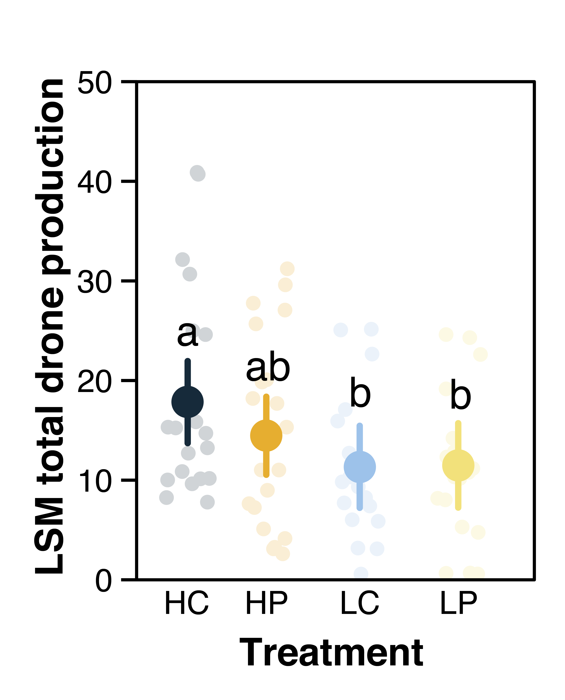
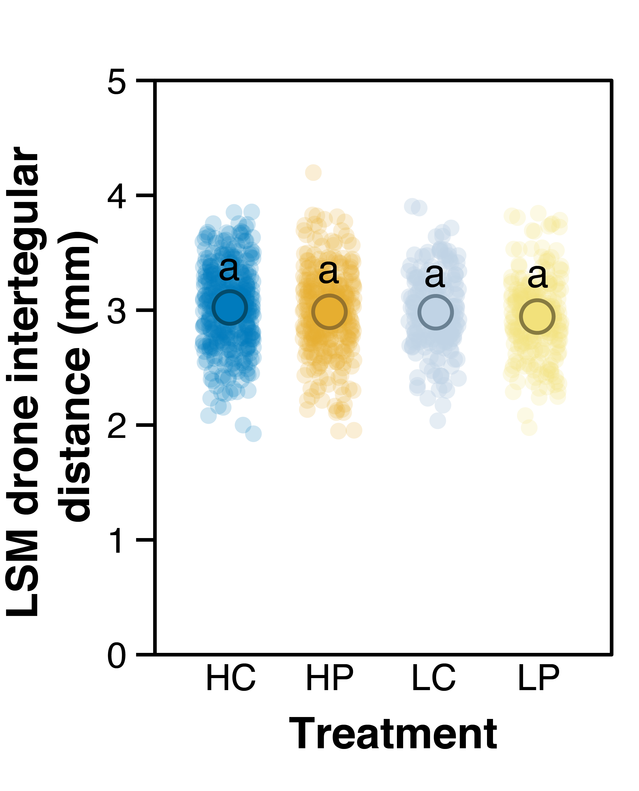
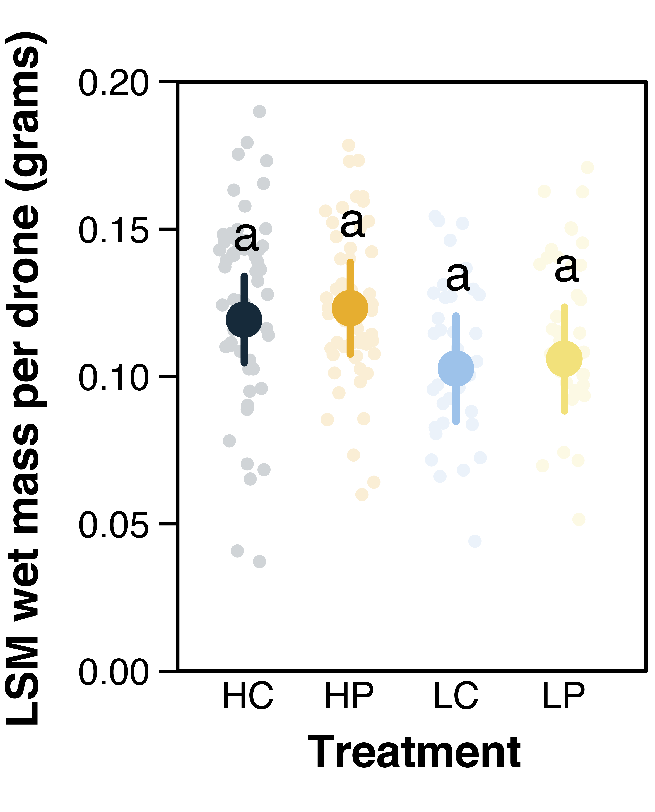
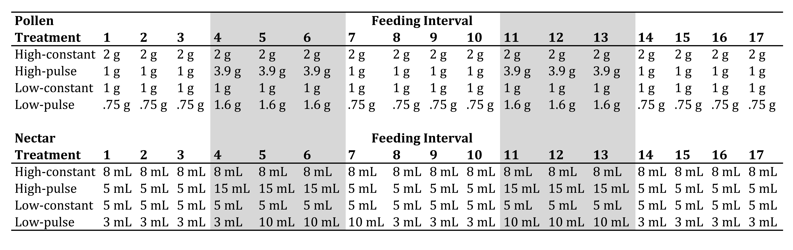

\captionsetup[table]{labelformat=empty}

# Introduction
**Bumble bee declines across Europe and North/South America are driven by a number of interacting anthropogenic factors such as pesticides, [@McArt2017], novel diseases from managed bees [@Brown2016a; @Furst2014], invasive species [@Morales2013], and climate change [@Kerr2015]).** There is a growing consensus that habitat loss is the most important driver of bee declines [@Roulston2011; @Senapathi2015a; @Goulson2016]. In the US Midwest, two centuries of agricultural intensification [defined here as the spatially extensive increase of agrichemical use and proliferation of monocultures e.g., @Benton2003] has altered bumble bee habitat, supplanting once continuous landscapes of prairie, savanna, and wetlands with highly productive agricultural crops [@Smith1998; @Rhemtulla2007]. Coincident with the transition to primarily agricultural land uses in the US, several species of bumble bee have declined precipitously [@Grixti2009; @Cameron2011; @Jacobson2018a].

Most importantly, agricultural intensification has led to wholesale change in the abundance and temporal availability of floral resources in the landscape [@Goulson2008; @Williams2012b; @Schellhorn2015c; @Goulson2015c; @Vaudo2018]. Historically, landscapes containing a continuous supply of diverse floral resources [e.g., tall-grass prairies @Hines2005] were prolific, however many of these landscapes have been lost to row-crop agriculture [@Smith1998], especially in the American Midwest. These landscapes, often devoid of flowering weeds, are largely depauperate of floral food resources for bumble bees aside from small patches of remnant natural habitat. In contrast, some agricultural landscapes contain mass-flowering crops (e.g., fruit crops, canola) that provide large pulses of floral resources, albeit over a short time period [@Westphal2009a; @Williams2012b; @Holzschuh2013; @Rundlof2014]. With respect to floral resource abundance, a range of possible food landscapes exist in agriculturally dominated regions, ranging from those with abundant, but temporally constrained floral resources, to those nearly devoid of floral resources.

Total floral resource abundance is an important factor that contributes to the growth and reproductive success of bumble bee colonies. For example, worker production is dependent on pollen and nectar influx to the colony; shortfalls can be detrimental to worker output [@Williams2012b; @Cartar1991; @Sutcliffe1988], and reproductive (drone and gyne) output can be enhanced with increased food availability [@Pelletier2003; @Crone2016]. Despite variable effect sizes and experimental methodologies, most studies tend to agree that increased flower abundance leads to increased bumble bee abundance [e.g., @Carvell2007; @Blaauw2014] and/or colony performance [e.g., @Spiesman2017].

While total food availability is key for developing bumble bee colonies, when food is available is also potentially important [@Schellhorn2015c]. Because bumble bee colonies have three distinct stages wherein food availability is crucial to colony success (queen colony establishment, colony worker buildup, and reproductive production), food shortages during any period of the colony life cycle can impair colony function. As such, continuous availability of flowers in the landscape is believed to be paramount for bumble bees [@Martins2018]. Past work has examined the effect of total food abundance [@Rotheray2017] and temporal availability [@Schmid-Hempel1998a] on colony development independently, however we have yet to test the interactive effect of the two. Understanding this interaction is crucial as we tend to see both total and temporal floral resource abundance vary together in agricultural landscapes.

Thus, is a lack of food, the temporal availability of food, or both limiting bumble bee colony success? Parsing these two interacting factors apart could help explain specific mechanisms underlying bumble bee declines in agricultural landscapes, as well as suggest conservation interventions. The interaction between total floral resource abundance and temporal availability in the landscape can be visualized conceptually as two potentially independent factors (Fig. 3.1). In this abstraction, landscapes in the lower left quadrant contain few flowers that are constantly available over the course of the growing season. This can be contrasted with landscapes in the upper left quadrant that contain the same total abundance of flowers but that occur during two narrow pulses (e.g., two mass-flowering crops). Given that bumble bees are obligate flower visitors [@Junker2010] existing as long-lived colonies, we might expect that access to an abundance of flowers that are consistently available over time (e.g., landscapes in lower right quadrant) would be critical for successful colony development.

To decouple the effects of total food abundance and temporal availability on bumble bee colony development, we designed a 2x2 factorial experiment that varied total food amount (both pollen and nectar) and its temporal availability. **Treatment designs were meant to simulate hypothetical scenarios that provide bumble bees either constantly available, or pulsed food resources at two ration levels: high and low [based on results from @Rotheray2017; Fig. 1]. These were designed to represent modalities of food intake corresponding to different types of agricultural landscapes.** For example, bumble bees might experience landscapes containing few floral resources and only during two short periods of time (e.g., Fig. 1, upper left quadrant) or a landscape containing many floral resources that are consistently available (e.g., Fig. 1, lower right quadrant).

**Using microcolonies of the Common Eastern bumble bee (Bombus impatiens Cresson), we predicted: (1) microcolonies provided high rations (pollen and nectar) in constant, equally sized portions would gain the most mass and have the greatest reproductive output; (2) microcolonies provided high rations in pulses separated by periods of reduced-portion rations would perform worse compared to those provided high, equally sized portions; (3) microcolonies provided low rations would perform worst, regardless of whether food was presented constantly in equally sized or pulsed rations, as colonies would be too nutritionally stressed regardless of relatively large, episodic influxes of food in the pulsed colonies. Because of _B. impatiens_' population stability in agricultural landscapes, we hypothesized that developing microcolonies would be resilient to dearth periods of food availability that is more broadly indicative of resilience to land-use change [@Cameron2011; @Grab2019].**

# Methods
## Experimental design and procedure
To assess the impact of varying total and temporal food abundance on bumble bee colony production, we designed a 2x2 factorial experiment utilizing microcolonies of _B. impatiens_. **Microcolonies are queen-less colonies comprised of exclusively workers. In the absence of the queen, a worker will establish dominance and lay unfertilized eggs that will develop into drones, analogous to worker production.** Microcolonies were used as proxies to full colonies given their ease of establishment and well-documented analogs to full colony development [@Tasei2008; @Dance2017; @Moerman2017]. **Additionally, microcolonies allow a level of control that is often not possible in field-based experimentation, making them ideal for manipulative experiments such as this.**

In three experimental rounds, we established a **total of 81 microcolonies from:** (Round 1) 10 queen-right colonies sourced from Koppert Biological Systems (Howell, MI) in February of 2018; (Round 2) 10 queen-right colonies from Koppert Biological Systems in May of 2018; (Round 3) 10 queen-right colonies sourced from BioBest Biological (Romulus, MI) in October of 2018. In each round, microcolony initiation was identical. We removed sets of 5 workers at random from a random colony and placed sets into one of 28 acrylic plastic microcolony rearing boxes (10 x 15 x 10 cm; **total of 7 microcolonies assigned randomly per treatment per experimental round)**, provisioning each with 2 grams of honey bee collected pollen (sourced from Koppert Biological Systems) homogenized with nectar and sealed in honey bee wax, as well as ad-libitum nectar through a sub-floor cotton wick and reservoir (ProSweet: MannLake LTD, Minnesota, **diluted to 1:1 Prosweet:Distilled Water**). **Selection of workers could include both adult and callow individuals, and we sourced each microcolony from the same natal colony.** To allow microcolony initiation, we left colonies undisturbed for approximately 1 week. Once we observed evidence of microcolony establishment (egg and larval brood masses visible) in each replicate box, we removed any remaining pollen and nectar, and initiated treatment regimes. In order to ensure microcolonies had equal capacity to respond to food availability (i.e., 5 workers per box), we replaced any deceased workers throughout the experiment with randomly selected workers from a random queen-right feeder colony. **Microcolonies were kept in a climate controlled rearing room, kept at 27C and ~60% relative humidity. The room was kept in darkness when unoccupied, and we used red darkroom lightbulbs during feeding and check-ins.**

Over 8 weeks, we simulated landscape-scale food availability of both pollen and nectar in four treatments: (1) low-constant; (2) high-constant; (3) low-pulsed; and (4) high-pulsed. Each represented a hypothetical landscape whereby total food abundance, and temporal availability were independently altered according to the factorial design (Fig. 1).  **To determine the total amount of pollen and nectar to supply in the treatments over the course of the experiment, we used measurements reported in [@Rotheray2017] (which reported on _ad-libitum_ consumption rates of full colonies of _B. terrestris_ at different colony size classes based on worker number), scaling total experiment food abundance at 100% ad-lib to 5 workers (approximately 33 grams of pollen and 300 grams of nectar) over 17 feeding intervals (~ 8 weeks). Low-ration treatments were scaled to 60% of the 100% ad-libitum value.**  Low-constant microcolonies were fed equal-sized **(rations were the same size during each feeding interval - Supplementary Table 1)** rations at 60% ad-lib levels; high-constant microcolonies fed equal-sized rations at 100% ad-lib levels. High-pulsed microcolonies were fed 100% ad-lib rations (equal pollen and nectar to high-constant treatment) but food resources were provided as two large pulses with **periods of reduced-portion rations (at 60% ad-lib) in periods before, between, and after pulses. Low-pulsed microcolonies were fed rations with temporal availability similar to high-pulsed microcolonies, but with reduced-portion rations throughout the experiment. Food pulses occurred during feeding intervals 4-6, and 11-13. We included low-ration treatments for two reasons: first, to see to what extent nutritionally challenged microcolonies would grow and reproduce; and second, to test whether our ration sizes calculated from @Rotheray2017 were meaningfully different between high- and low-ration treatments, as the numbers were not based on studies with _B. impatiens_.**

Every 3 days (hereafter interval feeding days: IFD), we weighed whole microcolonies by placing them on a scale and recording mass to the nearest 0.01 grams. After massing, we fed microcolonies by providing an appropriately massed pollen ball and nectar cup (see Supplemental Material for feeding schedule and layout of microcolony box) depending on the food treatment. After every 3 IFDs (every 9-12 Julian days), we removed and massed the pollen that was not consumed in the microcolony to calculate consumption. **In a few instances, we checked in on microcolonies every 4 Julian days due to accessibility issues to our lab space due to building renovations, rather than the typical 3 Julian days per IFD.** Nectar rations were replaced at every IFD - each massed before addition and after removal to determine nectar consumption [similar to @Rotheray2017]. Nectar rations were kept in sealed containers with only the nectar wick exposed, thereby minimizing any nectar evaporation. We massed the microcolony before the removal or addition of food to ensure that measurements were comparable between IFDs.

To determine if treatments affected the relative fitness of each microcolony, we censused colonies at each IFD. Censusing included tallying worker mortality and drone (male) emergence. We then removed and froze drones for subsequent analysis in which we determined average drone wet mass per IFD for each microcolony and individual drone intertegular distance (to nearest 0.01mm using ProgRes CapturePro v2.0).

## Data analysis
**We performed all data management and statistical analyses in R, version 3.5.3 [@rcite]. For each colony, we calculated the estimated "actual" microcolony mass relative to IFD 1. The goal of this calculation was to best determine how much biomass was being added to the brood mass within the microcolony between IFDs while factoring out food that we had added, but that had not yet been consumed by the microcolonies. This measure, Estimated Brood Mass at a given IFD (n = 1:17), captured wax, stored pollen and nectar, larvae, eggs, and pupae.  The calculation for Estimated Brood Mass, while useful, is somewhat limited as we were unable to factor out stored food, however it provides insight into the growth dynamics of each microcolony without having to destructively harvest colonies to account for food storage.  Additionally, we assumed that the amount of pollen and nectar stored by colonies would be directly related to both how much and when food was available, therefore would be affected differentially according to treatment.  To calculate estimated brood mass:**

$$
\begin{aligned}
Estimated Brood Mass_{IFD = n} = Microcolony Mass_{IFD = n} - Microcolony Mass_{Initial} - \\
(Pollen Added_{IFD = n-1} + Pollen Added_{IFD = n-2} + Pollen Added_{IFD = n-3}) + Pollen Consumed_{IFD = n}
\end{aligned}
$$

where MicrocolonyMass_(IFD=n) is the mass of the entire microcolony (including box) at `IFD = n` for n in [0, 17]; $MicrocolonyMass_{IFD=1}$ is the mass of the entire microcolony on the first IFD: **we calculated mass gains relative the mass at IFD = 1; $PollenConsumed_{IFD=n}$ is the average pollen consumed for a given IFD, calculated by taking the mass of pollen added minus the mass of pollen removed divided by 3 (the number of IFDs).  We assumed that pollen consumed was transported to and stored in the brood mass; and $PollenAdded_{IFD=n-i}$ is the mass of pollen added on 3 previous IFDs, as pollen was accumulated for 3 IFDs before being removed.** In the event that missing data prevented $EstimatedBroodMass_{IFD=n}$ from being determined (< 1% of data), we interpolated the missing values using the na.approx function from the R package zoo [@zoo]. Nectar storage/consumption within the microcolony was not considered for the MicrocolonyMass_(IFD=n) calculation, as we were not able to parse out nectar consumed by workers from nectar moved by workers to honey pots in the brood mass. **This value, Estimated Brood Mass, was then used in a repeated measures ANOVA as well as an analysis of growth rates of each microcolony (see below for details).** At the end of the experiment, we also measured the mass of the brood cluster (including all wax, remaining pupae, larvae, eggs, and pollen/nectar) alone after removing them from the microcolony boxes.  This value was used in a 2-way ANOVA (see below) to determine whether there was any difference in the end of experiment brood mass.

To evaluate whether treatments affected end of experiment brood mass, drone production, drone fitness parameters (wet mass and IT distance), or worker mortality, we constructed linear mixed-effects models (LMMs) on the combined data set from all three experimental rounds using the nlme package [@nlme]. Each model took the general form of a given response variable as a function of treatment (2 x 2 factorial between total food abundance and temporal variability) and experimental round, with random intercept and slope estimates for each microcolony. We estimated treatment means from LMMs [package: `lsmeans` @lsmeans] and used Tukey corrected pair-wise comparisons [package: `multcomp` @multcomp] to determine significance across treatments. Additional contrasts and effect sizes were calculated using the emmeans package [@emmeans]. Additionally, we calculated a rough food-to-drone conversion metric for both pollen and nectar by dividing the total pollen/nectar consumed by the average number of drones produced per treatment extracted from the linear mixed effects model on drone production.

We also constructed repeated measures ANOVAs using the nlme package to model colony mass, IFD average and cumulative drone production, IFD average and cumulative worker mortality, as well as IFD average and cumulative nectar and pollen consumption throughout the course of the 8-week experiments. These models took the general form of a given response as a function of treatment, date, and round, with a random slope and intercept estimates for each microcolony. To account for temporal autocorrelation, each analysis included a first order autocorrelation structure (function: corAR1) with a time covariate of measurement date and a grouping factor of colony identity. We specified the autocorrelation correction using the lag = 1 value from an identical model fitted with no autocorrelation structure.

Lastly, we calculated the growth rate of each microcolony for time periods relative to food pulses (Before pulse 1, during pulse 1, after pulse 1 and before pulse 2, during pulse 2, and after pulse2). This was accomplished by fitting a linear model of microcolony mass as a function of IFD (time) for each replicate microcolony [similar to analysis of @Crone2016, but with linear rather than exponential fitted models]. We then extracted each slope coefficient (i.e., the growth rate for a given microcolony during an aforementioned time period) and constructed an ANOVA for each time period to determine differences in growth rates among treatments, within time periods. The P-values associated with our initial slope estimates (mass as a function of IFD) were used to test whether growth was different than zero for a given time period. We also constructed a repeated measures ANOVA for all slope estimates across all time periods to determine if there were statistical differences in the average microcolony growth rates.

# Results
## Microcolony establishment
Overall, microcolony establishment success was high across experimental rounds, with only 3 of 84 failing to initiate (96% success). Two additional microcolonies contained a hyper-aggressive worker that killed all original and replacement nest-mates. Despite increased aggression, these single-worker colonies still produced males. However, we removed them from analyses as we did not feel that the response of a single-worker microcolony to treatments was comparable to standard, five-worker microcolonies.

## Microcolony growth (mass and food consumption)
End-of-experiment microcolony mass was driven by an interaction of both total food abundance, as well as temporal availability (Fig. 2b: interaction effect, F~1,24~ = 7.77, _P_ = 0.01). High-constant end-of-experiment microcolony brood mass was, on average, 92% greater than low-constant microcolonies (Fig. 2b, t~24~ = 5.33, _P_ < 0.001). High-pulsed end-of-experiment microcolony brood mass was 27% greater than low-pulsed microcolonies, however the difference was not statistically significant in a pairwise comparison (Fig. 2b, t~24~ = 1.77, _P_ = 0.311). Average microcolony brood mass at the end of the experiment for high-constant microcolonies was 56% greater relative to high-pulsed microcolonies (t~24~ = 4.37, _P_ = 0.001). 

There was a statistically significant effect of experimental round on end of experiment mass, with rounds 2 and 3 overall weighing less relative to round 1 (F~1,45~ = 35.88, _P_ < 0.001). However, the pattern of end of experiment brood mass across treatments was consistent between rounds (F~1,45~ = 3.18, _P_ = 0.081), thus we present pooled data in figures.

Microcolony growth rates over the course of the experiment varied as a function of both total food abundance and temporal availability (Fig. 3a: F~1,24~ = 12.13, _P_ = 0.002). Overall, high-constant microcolony average growth rates were the highest (Fig. 3b: t~24~ = 5.06, _P_ < 0.001), while low-constant microcolony growth rates were only statistically greater than zero during one time period (before pulse 1). Growth rate patterns were similar among both high- and low-pulsed treatments. Both pulsed treatments also experienced negative growth during periods following food pulses (Fig. 3a: after pulse 1/before pulse2, after pulse 2). Additionally, high- and low-pulsed microcolony mass gain was negligible during the first pulse, but it was greatest during the second food pulse.

The effect of treatments on pollen consumption varied by experimental round (F~2,41~ = 5.72, _P_ = 0.006), but the effect of treatments was similar across rounds (Treatment x Round: F~2,41~ = 2.98, _P_ = 0.068). Within treatments, only total food abundance affected pollen consumption (F~1,24~ = 22.83, _P_ < 0.001), with high-constant microcolonies consuming the most (Pollen: 14.80 +/- 0.813 grams total). High-pulsed ration microcolony pollen consumption was not significantly different than low-constant, or low-pulsed ration microcolonies, despite a 40% difference in pollen availability over the course of the experiment. Nectar consumption followed a similar pattern with consumption driven by total abundance (F~1,24~ = 60.98, _P_ < 0.001).  **Upon removing food for consumption measurements, microcolonies across all treatments often had food remaining to be consumed, indicating that ration scaling from Rotheray et al. (2017) was not a perfect match for _B. impatiens_.  Despite this, we still observed differential pollen and nectar consumption rates and separation of growth and reproduction across treatments, indicating that the difference in rations was enough to elicit a treatment response.**

## Microcolony demography (drone production and worker mortality)
**We found that on average total drone production increased with total food abundance (Fig. 4: F~1,24~ = 12.98, _P_ = 0.001) and not by temporal abundance (F~1,24~ = 1.468, _P_ = 0.238). High-constant ration microcolonies produced the most males and both low ration treatments produced on average 27% fewer drones, regardless of the temporal availability. In pairwise tests, however, high-pulsed microcolonies were similar in drone production to high-constant microcolonies (t~24~ = 1.59, _P_ = 0.398).**

There was an effect of experimental round on drone production, with rounds 2 and 3 overall producing fewer drones than in round 1. Like with end of experiment mass, the pattern of drone production relative to treatments was similar across experimental rounds (F~1,45~ = 0.94, _P_ = 0.336). Worker mortality was identical regardless of treatment, with on average 9 worker deaths per microcolony throughout the course of the 8-week experiment (average of 1.1 per week).

The efficiency of conversion from food to drone was roughly similar across treatments: to produce 1 drone required on average $0.70 \pm 0.08$ grams of pollen and $10 \pm 2.54$ grams of nectar.  **High-constant ration and low-pulsed microcolonies tended to be more efficient in producing drones, requiring on average 18% less pollen to produce a single drone and low-constant and high-pulsed microcolonies were the least efficient, especially with nectar, requiring 56% more to produce a single male relative to high-constant and low-pulsed microcolonies. Despite these large average differences, however, there was significant heterogeneity in the responses among replicates and thus these patterns were not statistically significant (treatment ration size effect: F~1,24~ = 0.192, _P_ = 0.664; treatment pulse effect: F~1,24~ = 0.03, _P_ = 0.853).**

## Drone size
**Drone wet mass was marginally greater in microcolonies provided high rations, with drones weighing on average 16% more than low ration microcolonies. However, post-hoc Tukey HSD tests did not show clear statistical differences among the treatment groups (Fig. 5). Intertegular distance did not vary by treatment, with drone body size being on average very similar (within tenths of a millimeter) across treatments (Fig. 6).**

# Discussion
By manipulating the amount and temporal availability of pollen and nectar, we show that both temporal availability and total food amount affect microcolony growth and reproduction, respectively. At the end of the experiment, colony mass was greatest when microcolonies were provided constant, high rations of pollen and nectar. This pattern matched our prediction that bumble bee microcolonies would grow the most when provided resources that mimic landscapes containing a high abundance of temporally consistent resources. Indeed, microcolonies provided either low or temporally variable rations struggled to gain mass, with several exhibiting a net loss over the experiment. However, drone production, arguably the most important metric of microcolony success, was impacted by total food amount, and to some extent temporal availability: colonies fed high-constant rations produced the most drones, however high-pulsed rations produced an intermediate number that was statistically indistinguishable between high-constant and both low-ration treatments. The contrasting effects of total [e.g., @Rotheray2017] and temporal [e.g., @Schmid-Hempel1998a] food availability demonstrated in this study suggest that, while both factors are important to the overall success of _B. impatiens_ microcolonies, total food abundance is more important to reproductive output.

## Microcolony mass gain
Microcolonies provided constant, high rations of food consistently gained mass over the course of the experiment. Regardless of their magnitude, food pulses were unable to rescue microcolony mass from periods of food scarcity. In fact, microcolonies experiencing pulsed food availability exhibited large increases and decreases in mass gain and loss coincident with pulse and dearth periods, respectively. In contrast, microcolonies experiencing constant rations were more consistent in their mass gain, with high ration treatments on average gaining mass across all experimental periods, and low ration treatments effectively gaining zero net mass over the course of the experiment.

Many studies examining bumble bee colony responses to environmental variables use mass as a proxy for reproductive output [@Goulson2002c; @Elliott2009; @Westphal2009a; @Hass2018a]. Indeed, mass in our experiments correlated with increased reproductive output (especially in the case of high-constant microcolonies). In the absence of demographic data, the average lower final mass of high-pulsed microcolonies might have suggested lower colony reproductive output. However, drone production was statistically indistinguishable in pulsed, high ration colonies - a signal that colony mass alone may not tell the complete story of bumble bee colony success. This finding corroborates other studies examining bumble bee reproductive success [@Williams2012b], and highlights the importance of additional supporting evidence to accompany trends in colony mass gain in order to fully understand colony fitness.

For our experiment, microcolony mass was our estimate of the total biomass of workers, brood, and nesting materials at any given time point. Yet, because bumble bees store nectar within their brood cluster, our estimate of microcolony mass also includes nectar acquisition and depletion. Nevertheless, the metric of colony mass is still relevant as stored nectar is critical for brood incubation and worker caloric intake [@Heinrich2004; @Goulson2008; @Rotheray2017]. Regardless of its various components, colony mass is best used in tandem with demographic or additional physical characteristics of the colony (e.g. estimated colony volume) in inferring colony “success”. Patterns of mass gain/loss are likely more appropriate to describe relative food intake and consumption, rather than reproductive output. Despite this, colony mass is still an important metric given that, for many species, colony size is an important precursor to the reproductive switch point of the colony [@Goulson2008].

## Drone production
A lack of an interaction between total food and temporal availability revealed a statistically clear, positive effect of increased food abundance on drone production independent of temporal availability. Our results suggest that having consistent, high amounts of food is best for developing B, impatiens colonies. The intermediate number of drones produced by high-pulsed microcolonies hints at a capacity for _B. impatiens_ to cope with periods of resource scarcity, even while performing poorly with regard to microcolony mass gain. An ability to cope with resource scarcity may help to explain why _B. impatiens_ has remained stable in agriculturally dominated landscapes, while other species (namely _B. affinis_ and _B. terricola_) have declined [@Cameron2011]. Worker polymorphism within _B. impatiens_ could explain this tolerance: smaller workers are more robust to periods of nectar starvation [@Couvillon2010; @Austin2019]. In our study, however, worker body size was not controlled for as workers selected for a given microcolony were selected at random from natal colonies. Given that microcolony mass in pulsed-treatment microcolonies increased more during food pulses, it could also be that workers increased food storage in order to functionally "smooth" their resource landscape over time. Such caching behavior, common among other insects and birds [@VanderWall1990], would allow for the consistent production of drones despite dearth periods encompassing the pulses.

**Drone size was similar across microcolonies, regardless of food quantity or temporal presentation. This is likely because drones are crucial for gene flow via dispersal. Therefore, colonies producing consistently sized, large-bodied drones [which correlates with increased flight range in worker bumble bees @Greenleaf2007b; and with increased sperm number in honey bees @Schluns2003] may be more successful in contributing genetic information to subsequent generations. Drones in the context of microcolonies are more closely analogous to workers in full colonies, and we would have expected workers produced under these resource conditions to vary in size in accordance with food availability [@Austin2019]. Altogether, the fact that drone size did not vary is likely due to selective pressures for consistently sized drones rather than any effect of the experimental conditions.**

Environmental stressors like variability in the abundance and temporal availability of food are likely to impact species differently [@Roulston2011; @Woodard2017]. While studies examining _B. impatiens_ reproductive response to variable food abundance are lacking, experiments have documented enhanced reproductive success in variable resource environments for a European species that is similarly tolerant to agricultural landscapes, _B. terrestris_ [@Schmid-Hempel1998a]. For example, @Schmid-Hempel1998a found that variable access to food led to an increased rate of food collection (mass gain) and increased production of workers. We found similar patterns of increased food collection rate among _B. impatiens_ microcolonies fed variable rations, especially during the second food pulse in our experiment. **However, increasing the rate of food collection during the second food pulse among high-pulsed microcolonies did not result in a clear increase in drone production: the number of drones produced was statistically indistinguishable from high-constant or any low ration microcolonies. Despite this, the ability for the microcolonies provided high pulsed-rations to consistently produce drones suggests a strategy for dealing with periods of low food availability. Increasing food collection and storage during pulses could allow _B. impatiens_ colonies to thrive in agricultural landscapes with highly variable floral resources.** This can be contrasted to other bumble bee species that may not engage in such foraging behaviors, or that have a more limited diet breadth [@Wood2019], potentially explaining the loss of these species (e.g., _B. affinis_ and _B. terricola_) from landscapes dominated by highly variable food resources, for example those found in many agroecosystems. Given this, it is important for future studies to consider comparative, interspecies studies which could identify species most sensitive to temporal bottlenecks in food availability. Such work would build on findings highlighting the importance of resource continuity for wild bee communities [@Martins2018] and could aid in the design of agricultural landscapes that support ecosystem service providers such as bumble bees [@Landis2017].

## Conclusions
Disentangling the contribution of environmental stressors to bumble bee decline is imperative if we are to be successful in stemming further losses. In this study, we showed that temporal and total pollen and nectar availability interact to impact bumble bee microcolony growth, with microcolonies provided more, temporally consistent food growing the most. We also showed that reproductive output was driven by total, and not temporal pollen and nectar availability: microcolonies provided full rations of pollen and nectar produced the most drones. While we examined laboratory microcolonies, the responses observed should be indicative of a standard, queen-right colony [@Tasei2008; @Dance2017]. **If anything, free-foraging full colonies may exhibit exacerbated responses to similar treatments, given that foraging is the most energetically expensive and risky activity for bumble bees. However, full colonies are able to store more food, which may act as a buffer against periods resource scarcity. Additionally, full colonies have the presence of a queen, which is also likely to impact colony growth and reproduction.** Even though temporal availability did not impact the reproductive output of _B. impatiens_ in this study, other species of bumble bee need to be examined for their ability to cope with boom-bust cycles of food availability. The implications of this work to managing landscapes is clear: at the least, an increase in total floral abundance (i.e., pollen and nectar) would likely have benefits to bumble bee colony reproduction. However, increasing both total floral abundance as well as temporal continuity would benefit species tolerant of dearth periods, as well as those sensitive to nutritional stress. Such efforts are essential to limit further loss of essential ecosystem service providers like bumble bees from landscapes in which temporally heterogenous food resources are commonplace.

# Acknowledgements
We would like to thank Neal Williams for feedback that greatly improved this manuscript. This project was funded by UW Madison Hatch award WIS01988. We thank Biobest and Koppert Biological Systems for providing queen-right colonies for this experiment. Data and code for all analyses, figures, and the manuscript are publically available: https://github.com/jhemberger.

# Figures and Tables

\newpage

```{r fig1, out.width = "100%", fig.pos = "h", fig.align = "center", echo = FALSE}
knitr::include_graphics(path = "ms_figs/fig1_conceptual.png")
```
**Figure 1: Conceptual depiction of variation in total resource amount as well as temporal availability. Total resource abundance increases along the x-axis, while temporal variance increases on the y-axis. We designed treatments based on the intersecting regions of total food abundance and temporal availability, with diagrams of food presentation shown in the inset graphs. The area under the curve in yellow represents the amount of food presented to bumble bee microcolonies, with both pollen and nectar following the same pattern. The area under the curve is equivalent within each food quantity category.**
\clearpage

\newpage
{ width=100% }
**Figure 2: (a) Least square mean (LSM) estimated brood mass (from equation 1) throughout the experiment and (b) Least square mean terminal brood mass (from microcolony dissections), HC = high-constant, HP = high-pulse, LC = low-constant, LP = low-pulse. Letters indicate significant differences. Gray bands reprsent food pulse periods. Error bars are 95% confidence intervals. Difference of 1 interval feeding day is equal to 3 Julian days.**
\clearpage

\newpage
{ width=100% }
**Figure 3: (a) Least square mean (LSM) estimated growth rate by time periods relative to pulses. Letters indicate significant differences both within and across temporal treatment categories (constant and variable) within periods (x-axis), and asterisks represent growth estimates significantly different than 0. Error bars are 95% confidence intervals. (b) Least square mean growth rates by treatment. HC = high-constant, HP = high-pulse, LC = low-constant, LP = low-pulse. Letters indicate significant differences. Gray bands reprsent food pulse periods. Error bars are 95% confidence intervals Difference of 1 interval feeding day is equal to 3 Julian days.**
\clearpage

\newpage
<center>
{ width=70% }
</center>
**Figure 4: Least square mean total drone production. HC = high-constant, HP = high-pulse, LC = low-constant, LP = low-pulse. Letters indicate significant differences. Error bars are 95% confidence intervals.**
\clearpage

\newpage
<center>
{ width=70% }
</center>
**Figure 5: Least square mean drone intertegular distance. HC = high-constant, HP = high-pulse, LC = low-constant, LP = low-pulse. Letters indicate significant differences. Error bars are 95% confidence intervals.**
\clearpage

\newpage
<center>
{ width=70% }
</center>
**Figure 6: Least square mean drone wet mass. HC = high-constant, HP = high-pulse, LC = low-constant, LP = low-pulse. Letters indicate significant differences. Error bars are 95% confidence intervals.**
\clearpage

\newpage

# Supplementary Material
**Supplementary Table 1:** Feeding schedule and pollen (top) and nectar (bottom) target ration sizes for all 17 feeding interval days.  Grayed areas denote food pulse periods.
{ width=100% }
\clearpage
\newpage


\begin{table}[] \centering
\textbf{Supplementary Table 2:} Mixed model parameter estimates for model with end of experiment microcolony mass as the response variable including 95\% confidence intervals.
\caption{}{}
  \label{subtab2}
\begin{tabular}{@{\extracolsep{5pt}}lD{.}{.}{-2} }
\\[-1.8ex]\hline
\hline \\[-1.8ex]
 & \multicolumn{1}{c}{\textit{Response Variable:}} \\
\cline{2-2}
\\[-1.8ex] & \multicolumn{1}{c}{Colony Mass} \\
\\[-1.8ex] & \multicolumn{1}{c}{\textit{linear}} \\
 & \multicolumn{1}{c}{\textit{mixed effects}} \\
\hline \\[-1.8ex]
 Intercept & 5.94^{***}$ $(5.04$, $6.85) \\
  Temporal food availability & 1.59^{**}$ $(0.69$, $2.49) \\
  Total food availability & 1.21^{*}$ $(0.30$, $2.11) \\
  Exp. round & -1.26^{***}$ $(-1.67$, $-0.85) \\
  Temporal:Total & 1.18^{*}$ $(0.28$, $2.08) \\
  Temporal:Exp. round & -0.54^{*}$ $(-0.95$, $-0.13) \\
  Total:Exp. round & -0.20$ $(-0.61$, $0.21) \\
  Temporal:Total:Exp. round & -0.38$ $(-0.79$, $0.03) \\
 \hline \\[-1.8ex]
Observations & \multicolumn{1}{c}{80} \\
Log Likelihood & \multicolumn{1}{c}{-147.64} \\
Akaike Inf. Crit. & \multicolumn{1}{c}{315.28} \\
Bayesian Inf. Crit. & \multicolumn{1}{c}{338.05} \\
\hline
\hline \\[-1.8ex]
\textit{Note:}  & \multicolumn{1}{r}{$^{*}$p$<$0.05; $^{**}$p$<$0.01; $^{***}$p$<$0.001} \\
\end{tabular}
\end{table}
\clearpage


\newpage
\begin{table}[] \centering
\textbf{Supplementary Table 3:} Mixed model parameter estimates for model with rate of mass gain as the response variable including 95\% confidence intervals.
\caption{}{}
  \label{suptab3}
\begin{tabular}{@{\extracolsep{5pt}}lD{.}{.}{-2} }
\\[-1.8ex]\hline
\hline \\[-1.8ex]
 & \multicolumn{1}{c}{\textit{Response Variable:}} \\
\cline{2-2}
\\[-1.8ex] & \multicolumn{1}{c}{Rate of Mass Gain} \\
\\[-1.8ex] & \multicolumn{1}{c}{\textit{linear}} \\
 & \multicolumn{1}{c}{\textit{mixed effects}} \\
\hline \\[-1.8ex]
 Intercept & 0.21^{***}$ $(0.10$, $0.32) \\
  Temporal food availability & 0.07$ $(-0.04$, $0.18) \\
  Total food availability & 0.13^{*}$ $(0.02$, $0.24) \\
  Time period (before pulse 1) & -0.67^{***}$ $(-0.89$, $-0.45) \\
  Time period (during pulse 1) & -0.40^{***}$ $(-0.62$, $-0.18) \\
  Time period (after pulse 1, before pulse 2) & -0.23^{*}$ $(-0.45$, $-0.01) \\
  Time period (during pulse 2) & -0.14$ $(-0.36$, $0.08) \\
  Temporal:Total & 0.20^{**}$ $(0.09$, $0.31) \\
 \hline \\[-1.8ex]
Observations & \multicolumn{1}{c}{140} \\
Log Likelihood & \multicolumn{1}{c}{-150.53} \\
Akaike Inf. Crit. & \multicolumn{1}{c}{321.06} \\
Bayesian Inf. Crit. & \multicolumn{1}{c}{349.89} \\
\hline
\hline \\[-1.8ex]
\textit{Note:}  & \multicolumn{1}{r}{$^{*}$p$<$0.05; $^{**}$p$<$0.01; $^{***}$p$<$0.001} \\
\end{tabular}
\end{table}
\clearpage


\newpage
\begin{table}[] \centering
\textbf{Supplementary Table 4:} Mixed model parameter estimates for repeated measures model with mass as the response variable including 95\% confidence intervals.
\caption{}{}
  \label{suptab4}
\begin{tabular}{@{\extracolsep{5pt}}lD{.}{.}{-2} }
\\[-1.8ex]\hline
\hline \\[-1.8ex]
 & \multicolumn{1}{c}{\textit{Response Variable:}} \\
\cline{2-2}
\\[-1.8ex] & \multicolumn{1}{c}{Mass Gain (Temporal trends)} \\
\\[-1.8ex] & \multicolumn{1}{c}{\textit{linear}} \\
 & \multicolumn{1}{c}{\textit{mixed effects}} \\
\hline \\[-1.8ex]
 Intercept & -793.66^{***}$ $(-982.99$, $-604.33) \\
  Total food availability & 1.15^{***}$ $(0.94$, $1.36) \\
  Temporal food availability & 0.13$ $(-0.08$, $0.34) \\
  Exp. round 1 & 4.88^{***}$ $(3.66$, $6.09) \\
  Exp. round 2 & 0.04$ $(-0.33$, $0.41) \\
  Interval feeding day & 0.04^{***}$ $(0.03$, $0.06) \\
  Total:Temporal & 0.19$ $(-0.02$, $0.40) \\
  Total:Exp. round 1 & 0.21$ $(-0.09$, $0.51) \\
  Total:Exp. round 2 & -0.07$ $(-0.37$, $0.23) \\
  Temporal:Exp. round 1 & 0.44^{**}$ $(0.14$, $0.74) \\
  Temporal:Exp. round 2 & -0.27$ $(-0.57$, $0.03) \\
  Total:Temporal:Exp. round 1 & 0.35^{*}$ $(0.06$, $0.65) \\
  Total:Temporal:Exp. round 2 & -0.25$ $(-0.55$, $0.05) \\
 \hline \\[-1.8ex]
Observations & \multicolumn{1}{c}{1,315} \\
Log Likelihood & \multicolumn{1}{c}{-2,589.40} \\
Akaike Inf. Crit. & \multicolumn{1}{c}{5,228.81} \\
Bayesian Inf. Crit. & \multicolumn{1}{c}{5,358.10} \\
\hline
\hline \\[-1.8ex]
\textit{Note:}  & \multicolumn{1}{r}{$^{*}$p$<$0.05; $^{**}$p$<$0.01; $^{***}$p$<$0.001} \\
\end{tabular}
\end{table}
\clearpage


\newpage
\begin{table}[] \centering
\textbf{Supplementary Table 5:} Mixed model parameter estimates for model with cumulative drone production as the response variable including 95\% confidence intervals.
\caption{}{}
  \label{suptab5}
\begin{tabular}{@{\extracolsep{5pt}}lD{.}{.}{-2} }
\\[-1.8ex]\hline
\hline \\[-1.8ex]
 & \multicolumn{1}{c}{\textit{Response Variable:}} \\
\cline{2-2}
\\[-1.8ex] & \multicolumn{1}{c}{Drone Production} \\
\\[-1.8ex] & \multicolumn{1}{c}{\textit{linear}} \\
 & \multicolumn{1}{c}{\textit{mixed effects}} \\
\hline \\[-1.8ex]
 Intercept & 29.02^{***}$ $(24.92$, $33.12) \\
  Temporal food availability & 2.62$ $(-1.48$, $6.72) \\
  Total food availability & 4.53^{*}$ $(0.43$, $8.63) \\
  Exp. round & -7.43^{***}$ $(-9.29$, $-5.57) \\
  Temporal:Total & 2.70$ $(-1.40$, $6.80) \\
  Temporal:Exp. round & -0.85$ $(-2.70$, $1.01) \\
  Total:Exp. round & -1.05$ $(-2.91$, $0.80) \\
  Temporal:Total:Exp. round & -0.92$ $(-2.78$, $0.94) \\
 \hline \\[-1.8ex]
Observations & \multicolumn{1}{c}{77} \\
Log Likelihood & \multicolumn{1}{c}{-245.15} \\
Akaike Inf. Crit. & \multicolumn{1}{c}{510.30} \\
Bayesian Inf. Crit. & \multicolumn{1}{c}{532.64} \\
\hline
\hline \\[-1.8ex]
\textit{Note:}  & \multicolumn{1}{r}{$^{*}$p$<$0.05; $^{**}$p$<$0.01; $^{***}$p$<$0.001} \\
\end{tabular}
\end{table}
\clearpage


\newpage
\begin{table}[] \centering
\textbf{Supplementary Table 6:} Mixed model parameter estimates for model with time to first drone as the response variable including 95\% confidence intervals.
\caption{}{}
  \label{suptab6}
\begin{tabular}{@{\extracolsep{5pt}}lD{.}{.}{-2} }
\\[-1.8ex]\hline
\hline \\[-1.8ex]
 & \multicolumn{1}{c}{\textit{Response Variable:}} \\
\cline{2-2}
\\[-1.8ex] & \multicolumn{1}{c}{Time to First Drone} \\
\\[-1.8ex] & \multicolumn{1}{c}{\textit{linear}} \\
 & \multicolumn{1}{c}{\textit{mixed effects}} \\
\hline \\[-1.8ex]
 Intercept & 17.24^{***}$ $(16.12$, $18.35) \\
  Total food availability & -0.50$ $(-1.62$, $0.61) \\
  Temporal food availability & 0.82$ $(-0.29$, $1.94) \\
  Exp. round 1 & -4.18^{***}$ $(-5.47$, $-2.88) \\
  Exp. round 2 & -2.23^{**}$ $(-3.47$, $-0.98) \\
  Total:Temporal & -0.95$ $(-2.07$, $0.17) \\
  Total:Exp. round 1 & -0.63$ $(-1.92$, $0.67) \\
  Total:Exp. round 2 & 0.06$ $(-1.18$, $1.31) \\
  Temporal:Exp. round 1 & 0.19$ $(-1.11$, $1.48) \\
  Temporal:Exp. round 2 & -0.55$ $(-1.80$, $0.70) \\
  Total:Temporal:Exp. round 1 & 1.15$ $(-0.15$, $2.45) \\
  Total:Temporal:Exp. round 2 & 0.24$ $(-1.01$, $1.49) \\
 \hline \\[-1.8ex]
Observations & \multicolumn{1}{c}{75} \\
Log Likelihood & \multicolumn{1}{c}{-204.21} \\
Akaike Inf. Crit. & \multicolumn{1}{c}{436.42} \\
Bayesian Inf. Crit. & \multicolumn{1}{c}{466.42} \\
\hline
\hline \\[-1.8ex]
\textit{Note:}  & \multicolumn{1}{r}{$^{*}$p$<$0.05; $^{**}$p$<$0.01; $^{***}$p$<$0.001} \\
\end{tabular}
\end{table}
\clearpage


\newpage
\begin{table}[] \centering
\textbf{Supplementary Table 7:} Linear model parameter estimates for model with drone mass as the response variable including 95\% confidence intervals.
\caption{}{}
  \label{suptab7}
\begin{tabular}{@{\extracolsep{5pt}}lD{.}{.}{-2} }
\\[-1.8ex]\hline
\hline \\[-1.8ex]
 & \multicolumn{1}{c}{\textit{Response Variable:}} \\
\cline{2-2}
\\[-1.8ex] & \multicolumn{1}{c}{Drone Mass} \\
\\[-1.8ex] & \multicolumn{1}{c}{\textit{OLS}} \\
\hline \\[-1.8ex]
 Intercept & 0.13^{***}$ $(0.12$, $0.14) \\
  Total food availability & 0.01$ $(-0.001$, $0.02) \\
  Temporal food availability & -0.01$ $(-0.02$, $0.003) \\
  Exp. round & -0.01^{***}$ $(-0.02$, $-0.005) \\
  Total:Temporal & 0.0003$ $(-0.01$, $0.01) \\
  Total:Exp. round & -0.001$ $(-0.01$, $0.005) \\
  Temporal:Exp. round& 0.004$ $(-0.002$, $0.01) \\
  Total:Temporal:Exp. round & -0.0001$ $(-0.01$, $0.01) \\
 \hline \\[-1.8ex]
Observations & \multicolumn{1}{c}{401} \\
R$^{2}$ & \multicolumn{1}{c}{0.06} \\
Adjusted R$^{2}$ & \multicolumn{1}{c}{0.05} \\
Residual Std. Error & \multicolumn{1}{c}{0.05 (df = 393)} \\
F Statistic & \multicolumn{1}{c}{3.87$^{***}$ (df = 7; 393)} \\
\hline
\hline \\[-1.8ex]
\textit{Note:}  & \multicolumn{1}{r}{$^{*}$p$<$0.05; $^{**}$p$<$0.01; $^{***}$p$<$0.001} \\
\end{tabular}
\end{table}
\clearpage


\newpage
\begin{table}[] \centering
\textbf{Supplementary Table 8:} Linear model parameter estimates for model with drone intertegular distance as the response variable including 95\% confidence intervals.
\caption{}{}
  \label{suptab8}
\begin{tabular}{@{\extracolsep{5pt}}lD{.}{.}{-2} }
\\[-1.8ex]\hline
\hline \\[-1.8ex]
 & \multicolumn{1}{c}{\textit{Response Variable:}} \\
\cline{2-2}
\\[-1.8ex] & \multicolumn{1}{c}{Drone Intertegular Distance} \\
\\[-1.8ex] & \multicolumn{1}{c}{\textit{OLS}} \\
\hline \\[-1.8ex]
 Intercept & 2.89^{***}$ $(2.84$, $2.94) \\
  Total food availability & -0.01$ $(-0.06$, $0.04) \\
  Temporal food availability & 0.001$ $(-0.05$, $0.05) \\
  Exp. round & 0.06^{***}$ $(0.03$, $0.08) \\
  Total:Temporal & -0.03$ $(-0.08$, $0.02) \\
  Total:Exp. round & 0.02$ $(-0.01$, $0.04) \\
  Temporal:Exp. round & 0.01$ $(-0.01$, $0.04) \\
  Total:Temporal:Exp. round & 0.02$ $(-0.01$, $0.04) \\
 \hline \\[-1.8ex]
Observations & \multicolumn{1}{c}{1,163} \\
R$^{2}$ & \multicolumn{1}{c}{0.03} \\
Adjusted R$^{2}$ & \multicolumn{1}{c}{0.02} \\
Residual Std. Error & \multicolumn{1}{c}{0.35 (df = 1155)} \\
F Statistic & \multicolumn{1}{c}{4.85$^{***}$ (df = 7; 1155)} \\
\hline
\hline \\[-1.8ex]
\textit{Note:}  & \multicolumn{1}{r}{$^{*}$p$<$0.05; $^{**}$p$<$0.01; $^{***}$p$<$0.001} \\
\end{tabular}
\end{table}
\clearpage


\newpage
\begin{table}[] \centering
\textbf{Supplementary Table 9:} Mixed model parameter estimates for model with total pollen consumption as the response variable including 95\% confidence intervals.
\caption{}{}
  \label{suptab9}
\begin{tabular}{@{\extracolsep{5pt}}lD{.}{.}{-2} }
\\[-1.8ex]\hline
\hline \\[-1.8ex]
 & \multicolumn{1}{c}{\textit{Response Variable:}} \\
\cline{2-2}
\\[-1.8ex] & \multicolumn{1}{c}{Total Pollen Consumption} \\
\\[-1.8ex] & \multicolumn{1}{c}{\textit{linear}} \\
 & \multicolumn{1}{c}{\textit{mixed effects}} \\
\hline \\[-1.8ex]
 Intercept & 8.92^{***}$ $(8.25$, $9.60) \\
  Temporal food availability & 0.45$ $(-0.22$, $1.13) \\
  Total food availability & 1.46^{***}$ $(0.78$, $2.13) \\
  Exp. round 1 & 3.77^{***}$ $(2.93$, $4.62) \\
  Exp. round 2 & -1.75^{***}$ $(-2.55$, $-0.95) \\
  Temporal:Total & 0.53$ $(-0.14$, $1.21) \\
  Temporal:Exp. round 1 & 0.43$ $(-0.41$, $1.27) \\
  Temporal:Exp. round 2 & -0.49$ $(-1.29$, $0.31) \\
  Total:Exp. round 1 & 0.98^{*}$ $(0.14$, $1.82) \\
  Total:Exp. round 2 & -0.83^{*}$ $(-1.63$, $-0.03) \\
  Temporal:Total:Exp. round 1 & 0.86$ $(0.02$, $1.71) \\
  Temporal:Total:Exp. round 2 & -0.70$ $(-1.50$, $0.10) \\
 \hline \\[-1.8ex]
Observations & \multicolumn{1}{c}{79} \\
Log Likelihood & \multicolumn{1}{c}{-186.53} \\
Akaike Inf. Crit. & \multicolumn{1}{c}{401.05} \\
Bayesian Inf. Crit. & \multicolumn{1}{c}{431.92} \\
\hline
\hline \\[-1.8ex]
\textit{Note:}  & \multicolumn{1}{r}{$^{*}$p$<$0.05; $^{**}$p$<$0.01; $^{***}$p$<$0.001} \\
\end{tabular}
\end{table}
\clearpage


\newpage
\begin{table}[] \centering
\textbf{Supplementary Table 10:} Mixed model parameter estimates for model with total nectar consumption as the response variable including 95\% confidence intervals.
\caption{}{}
  \label{suptab10}
\begin{tabular}{@{\extracolsep{5pt}}lD{.}{.}{-2} }
\\[-1.8ex]\hline
\hline \\[-1.8ex]
 & \multicolumn{1}{c}{\textit{Response Variable:}} \\
\cline{2-2}
\\[-1.8ex] & \multicolumn{1}{c}{Total Nectar Consumption} \\
\\[-1.8ex] & \multicolumn{1}{c}{\textit{linear}} \\
 & \multicolumn{1}{c}{\textit{mixed effects}} \\
\hline \\[-1.8ex]
 Intercept & 104.04^{***}$ $(100.47$, $107.61) \\
  Temporal food availability & 1.79$ $(-1.78$, $5.36) \\
  Total food availability & 11.58^{***}$ $(8.01$, $15.15) \\
  Exp. round 1 & 15.96^{***}$ $(11.52$, $20.41) \\
  Exp. round 2 & -6.47^{**}$ $(-10.70$, $-2.25) \\
  Temporal:Total & 1.56$ $(-2.01$, $5.13) \\
  Temporal:Exp. round 1 & 2.42$ $(-2.03$, $6.86) \\
  Temporal:Exp. round 2 & -1.51$ $(-5.73$, $2.72) \\
  Total:Exp. round 1 & 2.60$ $(-1.85$, $7.05) \\
  Total:Exp. round 2 & -4.45^{*}$ $(-8.67$, $-0.22) \\
  Temporal:Total:Exp. round 1 & 2.96$ $(-1.49$, $7.40) \\
  Temporal:Total:Exp. round 2 & 0.26$ $(-3.97$, $4.48) \\
 \hline \\[-1.8ex]
Observations & \multicolumn{1}{c}{79} \\
Log Likelihood & \multicolumn{1}{c}{-298.10} \\
Akaike Inf. Crit. & \multicolumn{1}{c}{624.20} \\
Bayesian Inf. Crit. & \multicolumn{1}{c}{655.07} \\
\hline
\hline \\[-1.8ex]
\textit{Note:}  & \multicolumn{1}{r}{$^{*}$p$<$0.05; $^{**}$p$<$0.01; $^{***}$p$<$0.001} \\
\end{tabular}
\end{table}
\clearpage


\newpage
\begin{table}[] \centering
\textbf{Supplementary Table 11:} Mixed model parameter estimates for model with total worker mortality as the response variable including 95\% confidence intervals.
\caption{}{}
  \label{suptab11}
\begin{tabular}{@{\extracolsep{5pt}}lD{.}{.}{-2} }
\\[-1.8ex]\hline
\hline \\[-1.8ex]
 & \multicolumn{1}{c}{\textit{Response Variable:}} \\
\cline{2-2}
\\[-1.8ex] & \multicolumn{1}{c}{Total Worker Mortality} \\
\\[-1.8ex] & \multicolumn{1}{c}{\textit{linear}} \\
 & \multicolumn{1}{c}{\textit{mixed effects}} \\
\hline \\[-1.8ex]
 Intercept & 8.94^{***}$ $(7.73$, $10.14) \\
  Temporal food availability & -0.12$ $(-1.33$, $1.09) \\
  Total food availability & -0.12$ $(-1.33$, $1.08) \\
  Exp. round 1 & -1.17$ $(-2.92$, $0.59) \\
  Exp. round 2 & -3.15^{***}$ $(-4.82$, $-1.48) \\
  Temporal:Total & 0.41$ $(-0.80$, $1.61) \\
  Temporal:Exp. round 1 & -1.28$ $(-3.03$, $0.47) \\
  Temporal:Exp. round 2 & 0.83$ $(-0.84$, $2.51) \\
  Total:Exp. round 1 & -0.004$ $(-1.76$, $1.75) \\
  Total:Exp. round 2 & 0.41$ $(-1.26$, $2.08) \\
  Temporal:Total:Exp. round 1 & 1.49$ $(-0.26$, $3.24) \\
  Temporal:Total:Exp. round 2 & -1.19$ $(-2.87$, $0.48) \\
 \hline \\[-1.8ex]
Observations & \multicolumn{1}{c}{79} \\
Log Likelihood & \multicolumn{1}{c}{-232.32} \\
Akaike Inf. Crit. & \multicolumn{1}{c}{492.64} \\
Bayesian Inf. Crit. & \multicolumn{1}{c}{523.50} \\
\hline
\hline \\[-1.8ex]
\textit{Note:}  & \multicolumn{1}{r}{$^{*}$p$<$0.05; $^{**}$p$<$0.01; $^{***}$p$<$0.001} \\
\end{tabular}
\end{table}
\clearpage


\newpage
\begin{table}[] \centering
\textbf{Supplementary Table 12:} Mixed model parameter estimates for model with pollen per drone produced as the response variable including 95\% confidence intervals.
\caption{}{}
  \label{suptab12}
\begin{tabular}{@{\extracolsep{5pt}}lD{.}{.}{-2} }
\\[-1.8ex]\hline
\hline \\[-1.8ex]
 & \multicolumn{1}{c}{\textit{Response Variable:}} \\
\cline{2-2}
\\[-1.8ex] & \multicolumn{1}{c}{Pollen per Drone} \\
\\[-1.8ex] & \multicolumn{1}{c}{\textit{linear}} \\
 & \multicolumn{1}{c}{\textit{mixed effects}} \\
\hline \\[-1.8ex]
 Intercept & 0.70^{***}$ $(0.64$, $0.77) \\
  Temporal food availability & 0.01$ $(-0.06$, $0.08) \\
  Total food availability & -0.01$ $(-0.08$, $0.06) \\
  Exp. round 1 & -0.16^{**}$ $(-0.26$, $-0.06) \\
  Exp. round 2 & -0.002$ $(-0.10$, $0.09) \\
  Temporal:Total & -0.07$ $(-0.14$, $0.002) \\
  Temporal:Exp. round 1 & -0.03$ $(-0.13$, $0.07) \\
  Temporal:Exp. round 2 & 0.05$ $(-0.05$, $0.14) \\
  Total:Exp. round 1 & 0.01$ $(-0.08$, $0.11) \\
  Total:Exp. round 2 & -0.06$ $(-0.15$, $0.04) \\
  Temporal:Total:Exp. round 1 & 0.09$ $(-0.004$, $0.19) \\
  Temporal:Total:Exp. round 2 & -0.04$ $(-0.13$, $0.06) \\
 \hline \\[-1.8ex]
Observations & \multicolumn{1}{c}{73} \\
Log Likelihood & \multicolumn{1}{c}{-36.08} \\
Akaike Inf. Crit. & \multicolumn{1}{c}{100.15} \\
Bayesian Inf. Crit. & \multicolumn{1}{c}{129.70} \\
\hline
\hline \\[-1.8ex]
\textit{Note:}  & \multicolumn{1}{r}{$^{*}$p$<$0.05; $^{**}$p$<$0.01; $^{***}$p$<$0.001} \\
\end{tabular}
\end{table}
\clearpage

\newpage
\begin{table}[] \centering
\textbf{Supplementary Table 13:} Mixed model parameter estimates for model with nectar per drone produced as the response variable including 95\% confidence intervals.
\caption{}{}
  \label{suptab13}
\begin{tabular}{@{\extracolsep{5pt}}lD{.}{.}{-2} }
\\[-1.8ex]\hline
\hline \\[-1.8ex]
 & \multicolumn{1}{c}{\textit{Response Variable:}} \\
\cline{2-2}
\\[-1.8ex] & \multicolumn{1}{c}{Nectar per Drone} \\
\\[-1.8ex] & \multicolumn{1}{c}{\textit{linear}} \\
 & \multicolumn{1}{c}{\textit{mixed effects}} \\
\hline \\[-1.8ex]
 Intercept & 9.89^{***}$ $(8.55$, $11.22) \\
  Temporal food availability & -0.31$ $(-1.65$, $1.03) \\
  Total food availability & 0.09$ $(-1.24$, $1.43) \\
  Exp. round 1 & -4.20^{***}$ $(-6.12$, $-2.28) \\
  Exp. round 2 & 1.52$ $(-0.33$, $3.38) \\
  Temporal:Total & -1.75^{*}$ $(-3.09$, $-0.41) \\
  Temporal:Exp. round 1 & 0.06$ $(-1.86$, $1.98) \\
  Temporal:Exp. round 2 & 0.63$ $(-1.23$, $2.48) \\
  Total:Exp. round 1 & -0.44$ $(-2.36$, $1.47) \\
  Total:Exp. round 2 & -0.32$ $(-2.17$, $1.54) \\
  Temporal:Total:Exp. round 1 & 1.55$ $(-0.37$, $3.47) \\
  Temporal:Total:Exp. round 2 & -0.20$ $(-2.06$, $1.65) \\
 \hline \\[-1.8ex]
Observations & \multicolumn{1}{c}{73} \\
Log Likelihood & \multicolumn{1}{c}{-217.06} \\
Akaike Inf. Crit. & \multicolumn{1}{c}{462.12} \\
Bayesian Inf. Crit. & \multicolumn{1}{c}{491.67} \\
\hline
\hline \\[-1.8ex]
\textit{Note:}  & \multicolumn{1}{r}{$^{*}$p$<$0.05; $^{**}$p$<$0.01; $^{***}$p$<$0.001} \\
\end{tabular}
\end{table}
\clearpage

\newpage
# References